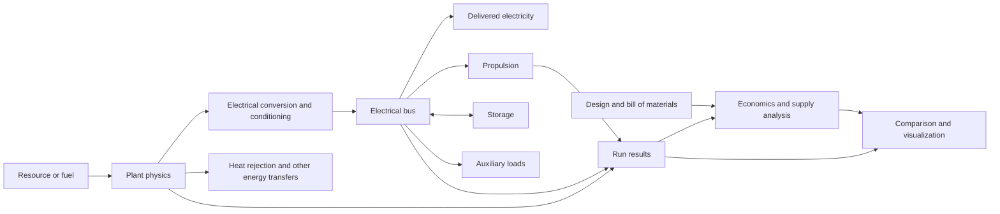

# Energy Systems Lab architecture

Status: architecture scaffold started 2026-09-15; backbone update 2026-09-20.

A first [DC network solver](networks.md) now assembles and solves electrical
connection equations. It is separate from the standalone generation models;
[Nonlinear TPV terminal integration](nonlinear-networks.md) is now implemented;
[Capacitor transients](transient-networks.md) are also implemented; more general
dynamics remain planned.

Current priority: physics/math execution interfaces and study scaffolding. Device
calibration and coupled heat balance are deferred by project decision. See
[backbone implementation](backbone.md) for implemented capabilities and the next
network/equation contracts. The longer-term delivery sequence below remains a
roadmap rather than an instruction to resume device calibration immediately.

Implementation update: a limited shared Python runner now executes independent TPV
and hydropower reference models, optional illustrative lifecycle economics, and
JSON/Markdown reports. The catalog has expanded to 26 entries; see
[technology map](technology-map.md) and [reference model specification](reference-models.md).
The module contracts below remain the broader target architecture, not a claim that
all of them have been implemented. The original TPV prototype remains unchanged.

## Mission and scope

Build one environment in which a user can select an energy technology, configure a
plant, simulate electricity production, optionally use that electricity for thrust,
and examine performance, materials, costs, and supply constraints together.

The scientific engine must work independently of a website. A future website will
provide plant discovery, configuration, diagrams, comparisons, and evidence browsing.
The same engine must support scripts and reproducible batch studies.

The original families were TPV, solar PV, solar thermal, wind, nuclear fission, and
nuclear fusion. The expanded catalog additionally covers water, geothermal, marine,
combustion, bioenergy, fuel cells, heat recovery, radioisotopes, direct conversion,
and ambient harvesting. Nuclear is a category; fission and fusion are different families.
Small modular reactors are a fission archetype, not a separate fundamental energy
source. A technology name alone does not specify a plant design.

Every complete generation model must expose an electrical output interface, including
gross generation, auxiliary demand, and net electricity. Early incomplete models can
return radiation or heat results, but cannot claim a complete electricity prediction.
Propulsion is a downstream use of energy with its own environment and constraints.

## Four distinct objects

| Object | Meaning | Example |
|---|---|---|
| Technology | A family of conversion mechanisms | Fission, wind, TPV |
| Plant design | A connected graph with geometry, ratings, and selected models | A specified reactor plus heat cycle and generator |
| Scenario | Environment, time horizon, resource availability, load, and economic basis | A site and hourly demand profile with a financing case |
| Study | One or more runs and a comparison objective | Designs delivering the same annual electricity or firm load |

Keep a fifth object, the model definition, explicit: its equations, fidelity,
parameters, evidence, valid domain, and implementation version determine what a run
can legitimately predict.

## System flow

Heat rejection, cooling, power conditioning, and auxiliaries belong in the system
definition. They are not invisible efficiency deductions. Avoid double-counting
auxiliaries when reporting net generation and bus-level energy delivery.

## Modules and their responsibilities

Start as a Python modular monolith. Do not introduce distributed services, a general
plugin framework, or a universal PDE solver before a working use case requires them.
The following are logical modules, not commitments to separate packages or services.

| Module | Responsibility | Small public interface, conceptually |
|---|---|---|
| Catalog | List technologies, archetypes, model availability, evidence coverage | `list_models(filters)` |
| Plant physics | Solve the selected conversion model under its stated assumptions | `evaluate(design, scenario, options)` |
| Study runner | Validate inputs, select execution mode, run sweeps, retain provenance | `run(study)` |
| Economics and supply | Turn a design, operating results, and sourced assumptions into cost and constraint results | `assess(design, run, economic_case)` |
| Comparison | Align compatible results and expose tradeoffs and missing information | `compare(results, comparison_spec)` |
| Reporting | Convert results into chart/table specifications and exports | `render_spec(results, view_spec)` |

Solvers, material-property libraries, and data loaders are internal implementations.
Introduce interchangeable adapters when a concrete second implementation needs the
same seam. The existing TPV model will eventually enter through an adapter after its
numerical and physical assumptions have been checked.

## Physics contracts

Represent plants as directed connections between physical modules. Connections must
carry enough state to determine interactions, not merely a scalar number of watts.

| Connection kind | Relevant quantities |
|---|---|
| Radiative | Spectral radiance or irradiance, wavelength grid, geometry, direction assumptions |
| Thermal | Temperature, heat-transfer rate, contact or transfer law |
| Electrical | Voltage, current, power, DC/AC convention and conditioning assumptions |
| Mechanical | Torque and angular velocity, or force and linear velocity |
| Fluid/material | Mass flow, composition, thermodynamic state, and enthalpy convention |

These are conceptual contracts; full network coupling is staged. An initial model
may use a fixed voltage or prescribed temperature if the assumption is recorded.

Internal numerical quantities use documented SI units. Inputs and displayed outputs
may use other units, with conversions at explicit interfaces. Every field has a
dimension, sign convention, shape, and definition. Currency is not a physical unit:
it also requires currency code, price year, and geographic basis.

Check energy and mass balances as applicable. For an explicit control volume,
change in stored energy equals energy entering minus energy leaving. Also check
applicable thermodynamic constraints; an energy balance alone does not establish
physical feasibility. Report balance residuals and their tolerances.

Distinguish three execution modes:

1. Algebraic evaluation for prescribed states and simple conversion models.
2. Coupled steady-state solutions for interacting operating points.
3. Transient integration for thermal inertia, storage, control, and changing inputs.

Spatial field solvers are added only where a stated question needs them. Record mesh,
time step, tolerances, and convergence evidence. Do not force every technology into
the highest available fidelity.

## Initial plant coverage

| Family | First useful model scope | Later extensions |
|---|---|---|
| TPV | Spectrum → intercepted radiation → cell I–V → conditioned electricity | Thermal feedback, photon recycling, spatial effects |
| Solar PV | Site irradiance and cell temperature → array DC → inverter AC | Shading, degradation, storage and dispatch |
| Solar thermal | Collected heat → thermal conversion → generator | Storage, transient receiver and cooling models |
| Wind | Wind resource → rotor/shaft power → generator electricity | Wake losses, structural limits, controls |
| Fission | Specified thermal source → power cycle → generator and auxiliaries | Design-specific transient models and fuel-cycle accounting |
| Fusion | Explicit assumed source performance → heat recovery → generation minus recirculating loads | Design-specific plasma/driver and plant coupling |

The first fission model is not a reactor-core or safety simulator. A specified heat
source must be labeled as an input assumption. Similarly, an assumed fusion heat
source must not imply demonstrated net-electric operation. Research and conceptual
designs remain usable for scenarios but are visually distinguished from measured
or operating-system evidence.

## Electricity and propulsion

Electricity is the common generation endpoint. Report gross electrical power,
auxiliary consumption, net electrical power, delivered energy, peak output, and
time-resolved output where supported. Net power may be negative; never clip it to
make an unfavorable operating point look productive.

Connect propulsion to the electrical bus as a load. Initial propulsion archetypes:

- Electric propeller/fan for a specified atmosphere and flight condition.
- Electric thruster for a specified propellant and space mission environment.

There is no universal watts-to-newtons conversion. A propulsion model must state its
momentum exchange, reaction mass or surrounding medium, efficiency model, operating
regime, and limits. Return thrust, electrical draw, mass flow where applicable,
rejected heat, and mission-integrated quantities when a duration is supplied.

For a simplified ideal jet, `F = mass_flow * exhaust_velocity` and jet kinetic power
is `0.5 * mass_flow * exhaust_velocity**2`. Electrical input also depends on efficiency
and auxiliary loads. These equations are an explicitly limited model, not a common
law for all propulsion types. Propellers require a different model.

Direct thermal propulsion can be added later as a separate energy path. Do not
silently route it through electricity or apply electric-thruster assumptions to it.

## Economics, materials, and supply

Economics consumes design quantities and simulated operating results. It must not
change physical outputs unless an explicit design or operating constraint does so.

An economic case includes currency, price year, region, build schedule, operating
lifetime, discount-rate convention, financing assumptions, utilization, fuel,
maintenance, replacements, decommissioning, and treatment of taxes/subsidies.
Distinguish missing information from zero cost.

Provide separate accounting views:

- Engineering quantities: mass, area, rated power, equipment counts, and replacement intervals.
- Project costs: equipment, installation, infrastructure, labor, financing, operation,
  and end-of-life costs. A material subtotal is not total project capital cost.
- Performance-normalized costs: installed cost per rated kW and discounted cost per
  delivered kWh, with the precise denominator shown.
- Supply constraints: material specification, required quantity, sourcing region,
  supplier concentration where evidenced, lead time, substitution options, and
  evidence coverage. Missing availability data does not mean unconstrained supply.

For a simple LCOE case, divide discounted eligible lifecycle costs by discounted
delivered electricity. Specify the meter location and discounting convention. Reject
an undefined or nonpositive energy denominator. Do not compare plant-only LCOE to a
storage-and-transmission-inclusive system cost without exposing the difference.

Separate evidence for real-world deployment maturity from model fidelity and model
validation. A detailed simulation of a concept does not make the concept deployable.
Current feasibility views need sourced dates, region, demonstrated scale, deployment
status, and project-specific constraints. The initial catalog leaves these unknown.

## Shared data records

Version these contracts before creating the first saved engine runs:

- `Parameter`: name, value or range/distribution, unit, scope, source references,
  observed date, retrieved date, geography, and status (measured, assumed, derived,
  or unknown). Preserve dependencies between uncertain parameters when known.
- `ModelDefinition`: identifier, version, equations/reference, required parameters,
  outputs, validity domain, fidelity, implementation status, verification and
  validation evidence.
- `PlantDesign`: identifier, selected models, physical connections, geometry,
  ratings, material quantities, and design constraints.
- `Scenario`: environment, resource/load series, initial and boundary conditions,
  time base, economic case reference, and uncertainty assumptions.
- `RunResult`: input snapshot/hash, model and data versions, solver configuration,
  random seed where used, status, metrics, time series/fields, balance residuals,
  warnings, provenance, and unsupported outputs.
- `Metric`: identifier, value, unit, aggregation, system scope, denominator,
  uncertainty representation, and evidence references.
- `ComparisonSpec`: objective, functional basis, filters, selected metrics,
  normalization rules, and requested views.

Invalid inputs, solver failure, out-of-domain results, and unsupported capability are
distinct statuses. Never substitute a default efficiency or a zero price silently.

## Fair comparisons

Allow technology exploration without claiming alternatives provide identical service.
Offer explicit comparison bases:

1. Same nameplate electrical capacity: useful for equipment comparisons, not equal energy.
2. Same annual delivered electricity: useful for energy accounting, not equal reliability.
3. Same time-resolved load and reliability target: includes needed storage, backup,
   curtailment, and relevant infrastructure.
4. Same land, mass, capital budget, or mission requirement: exposes constrained tradeoffs.

A modular-reactor-versus-solar study must select one of these bases and disclose
location, time horizon, resource assumptions, scale, system scope, and evidence quality.
Show incomparable or unsupported metrics as such. Do not produce a universal winner.

Comparison axes can include net energy, power density, efficiency, mass, land use,
water use, costs, construction time, fuel dependence, supply constraints, deployment
maturity, uncertainty, and propulsion performance. Include an axis only when its
definition and data support it. Environmental lifecycle metrics need a declared
lifecycle scope and external inventory data.

Sensitivity analysis should precede strong rankings. If uncertainty overlaps or an
ordering changes under plausible assumptions, show that dependence. User-defined
weighted scores are optional and must retain the original metrics and weights.

## Visualization and eventual website

Navigation: technology catalog → plant overview → design/scenario → results →
comparison workspace → evidence and assumptions.

A plant overview shows the conversion diagram, supported outputs, implementation
status, evidence quality, and available model fidelity. Unsupported capabilities are
visible rather than represented by fabricated demonstrations.

The reporting layer accepts a declarative view specification: metrics, axes, units,
filters, grouping, time range, uncertainty display, and normalization. Start with
static exports; later UI controls can generate the same specifications.

| Question | Suitable view |
|---|---|
| Where does energy go? | Balanced flow diagram and accounting table |
| What changes over time? | Aligned time series of generation, load, storage, and temperature |
| What trades off against what? | Scatter plot with uncertainty and optional Pareto frontier |
| What drives cost? | Cost breakdown and sensitivity chart |
| What depends on operating conditions? | Parameter sweep or heatmap |
| What evidence is missing? | Coverage table linked to sources |

Charts must expose units, assumptions, model version, and the meaning of uncertainty.
Use shared scales for comparisons where appropriate. Do not silently normalize
unrelated quantities into a radar chart or imply missing values are zero.

## Delivery sequence

1. Architecture scaffold: this document and the catalog; no new physics claims.
2. First vertical slice: verified TPV radiation and cell output, one saved scenario,
   electricity accounting, a results record, and a reproducible static report.
3. Economic slice: a sourced TPV design case, bill of materials, explicit cost gaps,
   and sensitivity analysis. Keep illustrative assumptions visibly labeled.
4. Second plant family: solar PV, testing which interfaces are actually reusable.
5. Comparison slice: functional-basis checks, side-by-side metrics, evidence coverage,
   and uncertainty-aware plots.
6. Catalog expansion: wind and fission system models, then clearly labeled fusion
   scenarios; prioritize order based on available evidence and the study objective.
7. Propulsion slice: electrical load coupling, one justified thruster model, and a
   mission scenario with mass and thermal accounting.
8. Website: expose the established catalog, study runner, and reporting interfaces.
9. Higher fidelity and control: targeted transient/spatial models, calibration,
   surrogates, and eventually control optimization or reinforcement learning.

Each implemented model needs dimensional checks, conservation checks, reference
cases, convergence checks where relevant, and documented validity limits. Empirical
validation is a separate milestone from passing computational tests.

## Decisions still open

- Primary near-term setting: terrestrial electricity, spacecraft, or both through
  separate scenarios. Do not compare across environments without explicit conversion.
- First target geography and economic price year.
- First comparison objective and required reliability level.
- Evidence sources and dataset redistribution constraints.
- Required fidelity and acceptable runtime for the first saved study.

These decisions do not block the scaffold. They become required inputs when an
implementation or numerical comparison depends on them.
