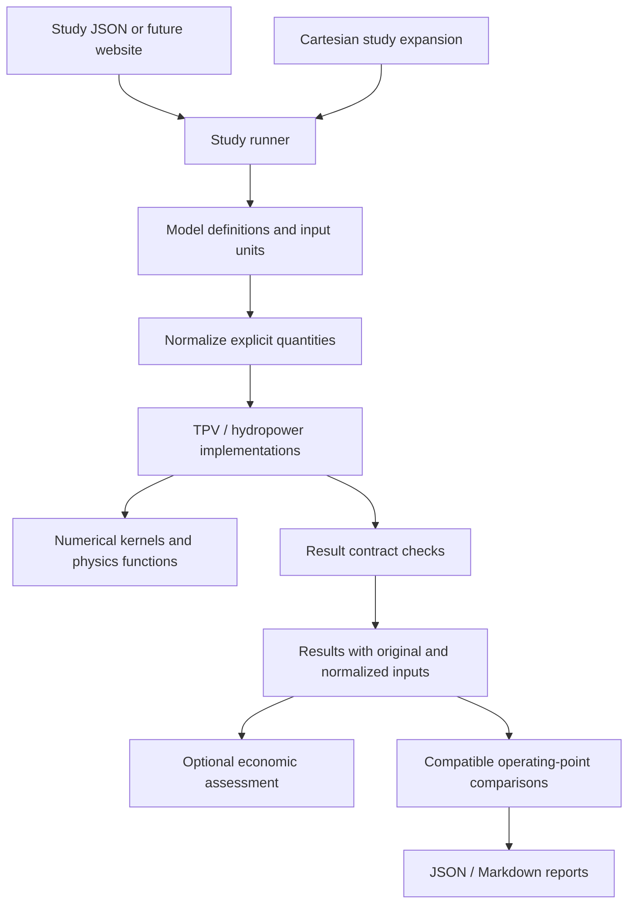

# Physics/math backbone — implementation 0.2, extended by 0.3

Update: [v0.5 capacitor transients](transient-networks.md) now supports a restricted
RC/TPV time-integration mode. Earlier roadmap statements below describe the prior
version; general dynamics and thermal coupling remain deferred.


Update 2026-09-20: [steady DC networks and linear equation assembly](networks.md)
are now implemented as a separate network execution mode. The network/equation
roadmap below is partially fulfilled for linear electrical systems only.

Further extension: [v0.4 nonlinear DC and TPV terminal integration](nonlinear-networks.md)
is implemented. Dynamic states and coupled thermal behavior remain deferred.

Original update 2026-09-18. Device calibration and coupled heat balance are intentionally
queued for a later batch. This pass develops reusable execution and study machinery.

## Implemented module seams



| Module | Public interface | Responsibility |
|---|---|---|
| Registry | `get_model(technology)`, definition `describe()` | Versioned identity, required parameter units, evaluator, execution mode, scope and documentation |
| Units | `normalize(value, target_unit)` | Explicit conversions with dimensional compatibility checks |
| Runner | `prepare_study(study)`, `run(study)` | Validate, preserve inputs, dispatch, verify result structure, assemble provenance |
| Numerics | `bisect(function, lower, upper, ...)` | Bracketed scalar solution with residual, iteration count and bracket width |
| Physics | Existing spectral integration and geometric quadrature | Reusable domain equations and fixed numerical integration |
| Studies | `run_sweep(spec)`, `compare(results, metric_names)` | Deterministic cases, failure isolation, compatible descriptive tables |
| Contracts | `validate_metrics(metrics)` | Finite values, explicit undefined status, unit and scope requirements |

A new implemented technology needs an evaluator and a registry definition. The CLI
and runner do not require a new dispatch branch. The catalog remains a broader
research/discovery inventory; runnable availability is derived from the registry.
Constraints involving several parameters remain in the physical implementation.

## Input quantities

Existing bare values retain their declared model units. An explicit quantity is:

```json
{"value": 20, "unit": "cm"}
```

It can be supplied for a parameter such as `gap_m`; the normalized model receives
0.2 m. The original quantity and the normalized values are both retained in the
result. Equivalent units produce equivalent metrics while retaining different
input hashes. This makes the exact original user input recoverable.

Supported units cover current inputs: length, absolute temperature, power, volume
flow, density, energy, current density, and dimensionless fractions/percentages.
Celsius is converted as an absolute temperature. Temperature differences are not
supported by that conversion. Unknown units, incompatible dimensions, booleans,
NaN, infinity, and malformed quantity objects are rejected.

This is an input conversion module, not symbolic unit algebra. Numerical solvers,
economics inputs, and output metrics keep their documented existing units; quantity
objects are currently supported only for model parameters.

## Numerical execution

The shared bisection solver replaces the private TPV maximum-power root loop. It
requires a continuous function and a valid sign-changing bracket (or endpoint root).
Absolute bracket-width tolerance controls convergence; function residual is reported
without pretending it has a universal unit or scale. Exhaustion and floating-point
resolution failures raise `ConvergenceError`. No last iterate is silently labeled
converged. Existing log-wavelength Simpson integration and geometric quadrature stay
available through the physics module.

Only prescribed steady operating points are runnable today. The architecture will
support additional solver modes through explicit model capabilities, rather than
assuming every model can participate in a transient or spatial solve.

## Batch study contract

A sweep contains `schema_version`, `study_id`, an embedded `base_study`, and `axes`.
Axis keys are model parameter names; values are explicit nonempty lists, optionally
using quantity objects. Sweep expansion is a Cartesian product, not a zipped list.
Parameter names are sorted for ordering; each axis preserves the user's value order.
Case identifiers use the sweep identifier and a one-based, zero-padded index.

The maximum is 256 cases. Execution is sequential and deterministic; no automatic
parallelism, interpolation, adaptive search, or random sampling is implied.

Structural errors fail before execution. Expected per-case input/domain/numerical
failures are recorded with settings and error messages while other cases continue.
Programming errors propagate rather than becoming apparent physical infeasibility.
A batch records completed/failed counts and has `completed`, `partial_failure`, or
`failed` status. Failed cases have no result metrics. All data needed to reproduce
successful cases is embedded in `batch.json`.

CLI exit codes: 0 for success, 1 for a saved batch with failed cases, 2 for an invalid
request or execution error. Output folders must not already exist.

## Comparison contract

Current comparisons describe operating points within the same model and exact
implementation digest. Requested metrics must have identical units and scope.
Missing metrics are errors; explicitly undefined values remain null. Economic
metrics and cross-technology comparisons are not accepted in this first contract.
The table retains source input hashes, and the saved source results retain all inputs.

This is not proof of equal service, reliability, energy delivery, or cost completeness.
No automatic ranking or technology recommendation is produced. The conservative
restriction avoids presenting a heat-to-electric converter and a complete generating
plant as equivalent merely because both report watts.

## Next architecture work, independent of calibration

1. **Physical network definition.** Introduce explicit modules, typed ports and
   connections. Ports declare conserved flows and conjugate state variables where
   appropriate: electrical current/voltage, thermal transfer/temperature, fluid
   mass flow/enthalpy. Validate dimensions, sign conventions, connectivity and
   degrees of freedom before execution. A connection graph alone is not a solver.
2. **Equation assembly.** Define algebraic residuals `R(z, inputs, t) = 0` with scaled
   residuals, variable bounds, Jacobian capability and convergence criteria.
   Reuse a proven solver implementation when this becomes an actual coupled model.
3. **Dynamic states.** Add initial state, derivatives or DAE residuals, event functions,
   consistent initialization, time-grid contracts and solver diagnostics. A fixed
   iteration loop must not stand in for a converged implicit integration step.
4. **Conservation accounting.** Declare control volumes and independently computed
   transfers/storage terms. Keep bookkeeping closure distinct from independent
   verification; the current TPV remainder is still obtained by subtraction.
5. **Fair service contracts.** Represent annual energy, time-resolved load/reliability,
   or mission requirements before allowing cross-technology comparisons. Add
   currency/year/region and lifecycle-scope checks for economics.
6. **Study orchestration.** Add resumable runs, uncertainty distributions and their
   correlations, sensitivity analysis, and constrained optimization after the
   underlying study objectives and outputs are explicit.
7. **Presentation interface.** Consume the same registry descriptions and result
   records in a website. Chart specifications need metrics, units, scope, selected
   axes, and missing-data behavior. No website dependency enters physics modules.

Beyond the linear DC implementation linked above, these remain design contracts. Device-data validation
and thermal coupling remain a separate deferred batch. The engine still runs TPV
and hydropower only; catalog expansion does not imply more runnable models.

## Commands

Run from the Sims workspace:

```bash
python3 -m engine describe tpv
python3 -m engine sweep systems/hydropower/scenarios/hydropower_sweep.json --output studies/local-hydro-grid
python3 -m engine sweep systems/tpv/scenarios/tpv_sweep.json --output studies/local-tpv-grid
python3 -m engine compare studies/backbone-hydro/result.json studies/backbone-hydro-high-head/result.json --metrics net_electric_power hydraulic_power --output studies/local-hydro-comparison
python3 -m unittest discover -s tests -v
```

Saved backbone examples are separate from earlier reference artifacts. Source hashes
allow historical results to remain honest without silently overwriting them.
